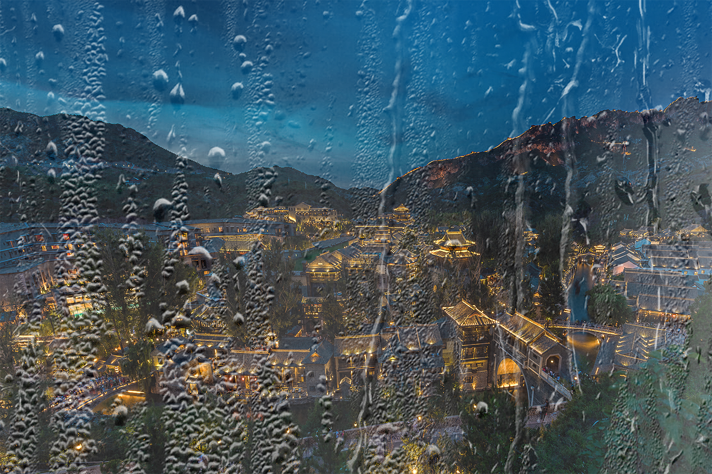
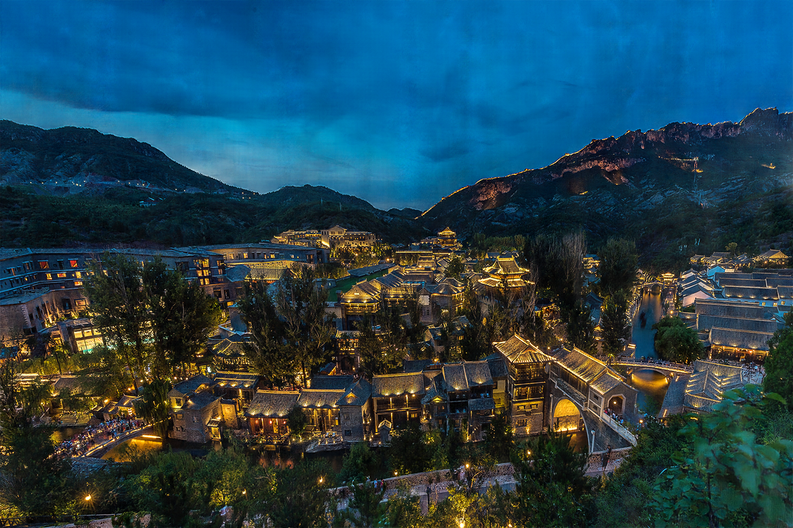
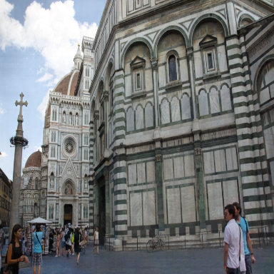
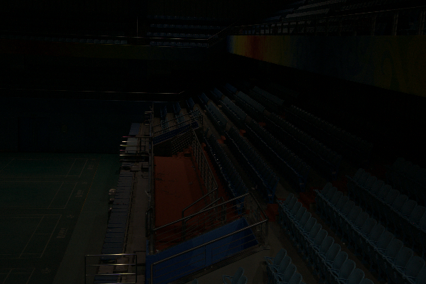
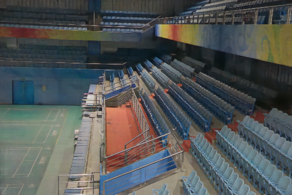
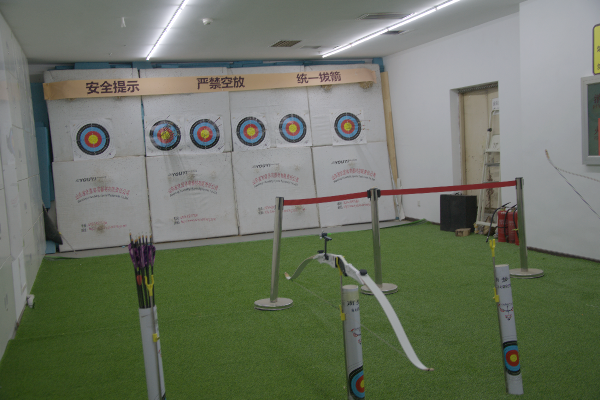
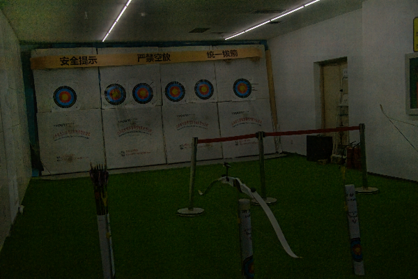

# 🌧️🌙 CXM-Vision Challenges
### 1. Learn to See in the Rain | 2. Learn to See in the Dark
    
Welcome to CXM-Vision Challenges, a playful yet insightful mini-project where we challenged ourself to make machines see under tough conditions — heavy rain and complete darkness!


[<a href="https://colab.research.google.com/drive/1m4RIk2t7L889GH6RqNYzxJadxvcozFZR?usp=sharing"></a>](https://colab.research.google.com/drive/1m4RIk2t7L889GH6RqNYzxJadxvcozFZR?usp=sharing)
### 💡 Project Highlights:

1. Learn to See in the Rain ☔
        Train a model to remove rain streaks and raindrops from images — a helping AI "wipe" the lens just like a virtual windshield wiper.

2. Learn to See in the Dark 🌑
        This part lets AI light up the night! Experimented with low-light enhancement to make dark images look like they were taken during the day.

### 🧪 Why?
Because rain and night are not excuses for bad AI vision anymore!

This project is like giving your AI a pair of night-vision goggles and an umbrella.

### ⚙️ What's inside?
- ✅ Tiny and lightweight models (perfect for fun or prototyping)
- ✅ Minimal test code on [<a href="https://colab.research.google.com/drive/1m4RIk2t7L889GH6RqNYzxJadxvcozFZR?usp=sharing"></a>](https://colab.research.google.com/drive/1m4RIk2t7L889GH6RqNYzxJadxvcozFZR?usp=sharing) 
- ✅ Synthetic datasets for testing (rainy and dark images)
- ✅ Testing pipelines with [UV](https://docs.astral.sh/uv/)
- ☑️ Training pipelines (support [**BasicSR**](https://github.com/XPixelGroup/BasicSR) training framework)
- ☑️ Web frontend tools with "before vs after"


## Introduction
This project, **CXM Vision**, focuses on solving challenging computer vision tasks such as raindrop removal and low-light image enhancement. To build the baseline model, we employed the **Gated-CNN module** introduced by the **MambaOut** Paper, which is optimized for high performance with a balance between accuracy and computational efficiency. We also utilize the U-net architecture to enhance the model's ability to perform image restoration tasks effectively. The project leverages datasets like **UAV-Rain1k**, **LOLv1**, **LOLv2**, and **LOLv2_real** to train and evaluate the model.

### Proposed Baseline: Mambaout-Unet
- **Parameters**: ~14.9 M  
- **Model Size**: ~57 MB  
- **FLOPs**: ~40 GFLOPs (for a 256x256 input image) 


### 📊 Benchmark Results

| Task                  | Dataset       | PSNR (dB) | SSIM  |  #Parameters (M) | Inference Time (ms) |
|-----------------------|---------------|-----------|-------|------------------|----------------------|
| Raindrop Removal      | UAV-Rain1k    | 23.27     | 0.874 | 14.9 M           | 12.3                |
| Low-Light Enhancement | LOLv1         | 20.812    | 0.811 | 14.9 M           | 13.1                |
| Low-Light Enhancement | LOLv2         | 23.27     | 0.917 | 14.9 M           | 13.4                |
| Low-Light Enhancement | LOLv2_real    |     -     |   -   | 14.9 M           | 13.6                |

## Dataset Sample


| Task                  | Input Image                                      | Ground Truth (GT) Image                              | Predicted Output                                   |
|-----------------------|--------------------------------------------------|-----------------------------------------------------|--------------------------------------------------|
| Raindrop Removal      |  |  |  |
|  Low-Light Enhancement LOLv2    |  |  |  |
| Low-Light Enhancement LOLv1|  |    |  |
| Low-Light Enhancement Real|  |    |  |


## Instruction 

You can try out the model weights and testing images included in the repository by following those steps:
1. Clone the repository:
    ```bash
    git clone https://github.com/lienghongky/cxm-vision
    cd cxm-vision
    ```
2. Install dependencies:

    Install the **UV** package manager if it is not already installed. You can install it using the following command:

    ```bash
    pip install uv
    ```

    While the environment is synced automatically, it may also be explicitly synced using:

    ```bash
    uv sync
    ```
3. Prepare your dataset by organizing it in the `datasets/` directory as shown bellow.
    
    Below is an example of the dataset structure used in this project:
    ```
    /cxm-vision/datasets/
    ├── UAV-Rain1k/
    │   ├── input/
    │   │   ├── rain_image1.jpg
    │   │   ├── rain_image2.jpg
    │   │   └── ...
    │   ├── gt/
    │   │   ├── clean_image1.jpg
    │   │   ├── clean_image2.jpg
    │   │   └── ...
    ├── LOLv1/
    │   ├── input/
    │   ├── gt/
    │   └── ...
    ```
    Each dataset contains paired images: `input` (e.g., rainy or low-light images) and `gt` (ground truth clean or enhanced images).


4. Test:
    - Test Datasets 
    ```bash
        uv run main.py --weights PATH_TO_WEIGHT_FOR_SPECIFIC_TASK --input_dir PATH_TO_TEST_SET --save 
    ```
    - Test your own file 
    ```bash
       uv run main.py --weights PATH_TO_WEIGHT_FOR_SPECIFIC_TASK --input_dir PATH_TO_TEST_FILE --save
    ``` 
    
### 🔗 Download Pretrained Model Weights
You can download additional pretrained model weights from the following link:  
[Google Drive - Model Weights](https://drive.google.com/drive/folders/11zlxsY3kbI8BTZe2Urc4_eto-DqKlYPT?usp=drive_link)

## Related Datasets and Papers

| Dataset      | Paper Title                                                                 | Paper Link                                                                                     | Dataset Link                                                                                     |
|--------------|-----------------------------------------------------------------------------|-----------------------------------------------------------------------------------------------|--------------------------------------------------------------------------------------------------|
| UAV-Rain1k   | UAV-Rain1k: A Benchmark for Raindrop Removal from UAV Aerial Imagery       | [Link](https://arxiv.org/pdf/2402.05773)                                                      | [Link](https://drive.google.com/open?id=1e7R76s6vwUJxILOcAsthgDLPSnOrQ49K)                      |
| RainDrop     | Attentive generative adversarial network for raindrop removal from a single image | [Link](https://arxiv.org/pdf/1711.10098)                                                      | [Link](https://github.com/rui1996/DeRaindrop?tab=readme-ov-file)                                |
| RainDS       | Removing Raindrops and Rain Streaks in One Go                              | [Link](https://openaccess.thecvf.com/content/CVPR2021/papers/Quan_Removing_Raindrops_and_Rain_Streaks_in_One_Go_CVPR_2021_paper.pdf) | [Link](https://github.com/Songforrr/RainDS_CCN?tab=readme-ov-file)                              |
| DID-Data     | Density-aware Single Image De-raining using a Multi-stream Dense Network   | [Link](https://openaccess.thecvf.com/content_cvpr_2018/papers/Zhang_Density-Aware_Single_Image_CVPR_2018_paper.pdf) | [Link](https://github.com/hezhangsprinter/DID-MDN)                                              |
| SPA          | Spatial Attentive Single-Image Deraining with a High Quality Real Rain Dataset | [Link](https://arxiv.org/abs/1908.01979)                                                      | [Link](https://stevewongv.github.io/)                                                           |
| DDN-Data(aka: Test-1400,test-Fu,Rain-1400 )     | Removing rain from single images via a deep detail network                 | [Link](https://openaccess.thecvf.com/content_cvpr_2017/papers/Fu_Removing_Rain_From_CVPR_2017_paper.pdf) | [Link](https://xueyangfu.github.io/projects/cvpr2017.html)                                      |
| Rain Drop    | Dual-Pixel Raindrop Removal                                                | [Link](https://bmvc2022.mpi-inf.mpg.de/0439.pdf)                                              | [Link](https://github.com/Yizhou-Li-CV/DPRRN)                                                   |
| RAIN800      | Image De-raining Using a Conditional Generative Adversarial Network        | [Link](https://arxiv.org/pdf/1701.05957)                                                      | [Link](http://yu-li.github.io/paper/li_cvpr16_rain.zip)                                         |
| LOLv2         | From Fidelity to Perceptual Quality: A Semi-Supervised Approach for Low-Light Image Enhancement | [Link](https://openaccess.thecvf.com/content_CVPR_2020/papers/Yang_From_Fidelity_to_Perceptual_Quality_A_Semi-Supervised_Approach_for_Low-Light_CVPR_2020_paper.pdf) | [Link](https://github.com/flyywh/CVPR-2020-Semi-Low-Light) |
| LOLv1         | Deep Retinex Decomposition for Low-Light Enhancement | [Link](https://arxiv.org/pdf/1808.04560v1) | [Link](https://daooshee.github.io/BMVC2018website/) |


## Acknowledgement

This project adopts the **Gated-CNN** from **MambaOut** model from the paper *"Do We Really Need Mamba for Vision?"* (CVPR 2025) using U-net architecture to perform image restoration tasks effectively. 
For more details on MambaOut, visit the [MambaOut GitHub repository](https://github.com/yuweihao/MambaOut).

For more details, refer to the documentation or contact the project maintainers.
