# 🌧️🌙 CXM-Vision Challenges
<p align="center">
    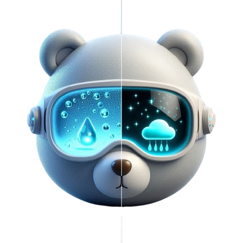
</p>
<p align="center" style="font-size:20px">
    <strong style="color:lightblue">[1]. Learn to See in the Rain</strong>
    <strong >|</strong>
    <strong style="color:lightgreen;">[2]. Learn to See in the Dark</strong>
</p>

    
Welcome to CXM-Vision Challenges, a playful yet insightful mini-project where we challenged ourself to make machines see under tough conditions — heavy rain and complete darkness!
**🧪 Why?**
Because rain and night are not excuses for bad AI vision anymore! This project is like giving your AI a pair of night-vision goggles and an umbrella.


[<a href="https://colab.research.google.com/drive/1m4RIk2t7L889GH6RqNYzxJadxvcozFZR?usp=sharing"></a>](https://colab.research.google.com/drive/1m4RIk2t7L889GH6RqNYzxJadxvcozFZR?usp=sharing)
### 💡 Project Highlights and Challenge Tracks:

1. **Learn to See in the Rain ☔**

    Train a model to remove rain streaks and raindrops from images — a helping AI "wipe" the lens just like a virtual windshield wiper.

2. **Learn to See in the Dark 🌑**

    This part lets AI light up the night! Experimented with low-light enhancement to make dark images look like they were taken during the day.

### 🏆 Challenge Rules

1. **Fair Play**: All participants must use the original datasets and adhere to the evaluation protocols outlined in original paper.
2. **Originality**: Submissions must be your own work. Plagiarism or unauthorized use of others' work will result in disqualification.
3. **Reproducibility**: Ensure that your code and results can be reproduced. We recommend providing a Colab notebook or using the `uv` for seamless reproducibility.
4. **📝 Submission**: Push your code and method to your own GitHub repository and make a pull request to update the table below with your results:
###  Leader Board
| Task Type             | Method Name            | GitHub Repository Link                                      | PSNR (dB) | SSIM   | Inference Time (s) | Description                                                                 |
|-----------------------|------------------------|------------------------------------------------------------|-----------|--------|---------------------|-----------------------------------------------------------------------------|
| Task here | Your Method Name Here  | [GitHub Link](https://github.com/lienghongky/cxm-vision)   | XX.XXX    | X.XXXX | X.XX                | Brief description of your method and its unique features.                  |


Good luck, and may the best solution win! 🚀


## Introduction (Our Baseline)
This project, **CXM Vision**, focuses on solving challenging computer vision tasks such as raindrop removal and low-light image enhancement. To build the baseline model, we employed the **Gated-CNN module** introduced by the **MambaOut** Paper, which is optimized for high performance with a balance between accuracy and computational efficiency. We also utilize the U-net architecture to enhance the model's ability to perform image restoration tasks effectively. The project leverages datasets like **UAV-Rain1k**, **LOLv1**, **LOLv2**, and **LOLv2_real** to train and evaluate the model.


### ⚙️ What's inside?
- ✅ Tiny and lightweight models (perfect for fun or prototyping)
- ✅ Minimal test code on [<a href="https://colab.research.google.com/drive/1m4RIk2t7L889GH6RqNYzxJadxvcozFZR?usp=sharing"></a>](https://colab.research.google.com/drive/1m4RIk2t7L889GH6RqNYzxJadxvcozFZR?usp=sharing) 
- ✅ Export ONNX model for Mobile and Web [<a href="https://colab.research.google.com/drive/1m4RIk2t7L889GH6RqNYzxJadxvcozFZR?usp=sharing"></a>](https://drive.google.com/file/d/11zVgEYzbos0ke0egKw3PUynVYi8LZSaj/view?usp=sharing) | [<a href="https://drive.google.com/drive/folders/11zlxsY3kbI8BTZe2Urc4_eto-DqKlYPT?usp=drive_link"></a>](https://drive.google.com/drive/folders/11zlxsY3kbI8BTZe2Urc4_eto-DqKlYPT?usp=drive_link)

- ✅ Synthetic datasets for testing (rainy and dark images)
- ✅ Testing pipelines with [UV](https://docs.astral.sh/uv/)
- ☑️ Training pipelines (support [**BasicSR**](https://github.com/XPixelGroup/BasicSR) training framework) [*Help wanted !!*]
- ☑️ Web frontend tools with "before vs after" : Beta(without WebGPU) Live at [Squoosh AI+](https://compress.coxomo.com/) [*Help wanted !!* ]


### Proposed Baseline: cxm-vision-unet v1
- **Parameters**: ~14.9 M  
- **Model Size**: ~57 MB  
- **FLOPs**: ~47.7 GFLOPs (for a 256x256 input image)


### 📊 Benchmark Results [Weights](https://drive.google.com/drive/folders/11zlxsY3kbI8BTZe2Urc4_eto-DqKlYPT?usp=drive_link)

| Task                  | Dataset       | PSNR (dB) | SSIM  |  #Parameters (M) | Inference Time (s)   |
|-----------------------|---------------|-----------|-------|------------------|----------------------|
| Raindrop Removal(SOTA)| UAV-Rain1k    | 25.258    | 0.9086| 14.9 M           | 0.42   (1500x1000)   |
| Rain streak Removal.  | Rain100L      | 35.203    | 0.9656| 14.9 M           | 0.05   (480x320)     |
| Rain streak Removal.  | Rain100H      | 30.084    | 0.8839| 14.9 M           | 0.05   (480x320)     |
| Low-Light Enhancement | LOLv1         | 22.655    | 0.8363| 14.9 M           | 0.08   (600x400)     |
| Low-Light Enhancement | LOLv2         | 23.580    | 0.9279| 14.9 M           | 0.05   (284x284)     |
| Low-Light Enhancement | LOLv2_real    |     -     |   -   | 14.9 M           | -      (600x400)     |

### 📊 UAV-Rain1k: Follow previous works on (YCbCr color space)
| Method                  | Type          | #Parameters (M) | FLOPs (G) | PSNR (dB) | SSIM   |
|-------------------------|---------------|-----------------|-----------|-----------|--------|
| DSC                     | Prior         | -               | -         | 16.68     | 0.7142 |
| RCDNet                  | CNN           | 3.7             | 21.2      | 22.48     | 0.8753 |
| SPDNet                  | CNN           | 3.04            | 89.3      | 22.54     | 0.8594 |
| IDT                     | Transformer   | 16.41           | 61.9      | 22.47     | 0.8957 |
| Restormer               | Transformer   | 26.12           | 174.7     | 24.78     | 0.9054 |
| DRSformer               | Transformer   | 33.65           | 242.9     | 24.93     | **0.9155** |
| **Ours**                | Gated-CNN     | 14.9            | 47.7      | **25.25** | 0.9086 |
## Dataset Sample


| Task(Datasets)    | Input Image                                      | Ground Truth (GT) Image                             | Predicted Output                                   |
|-------------------|--------------------------------------------------|-----------------------------------------------------|--------------------------------------------------|
| UAV-Rain1k        | 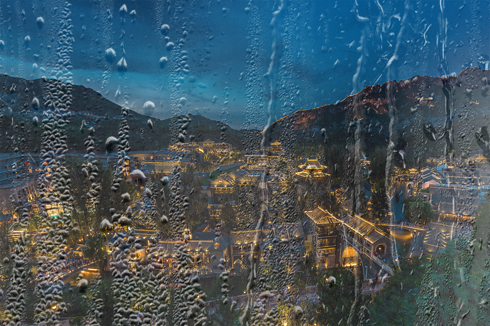  | 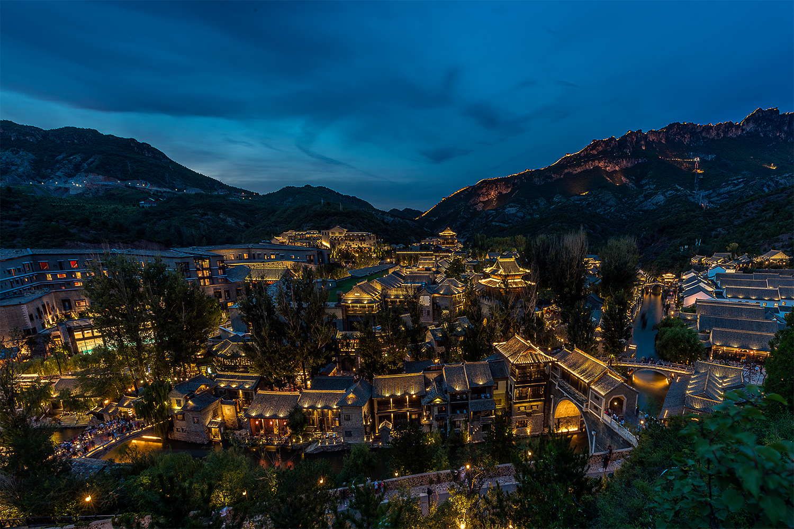        | 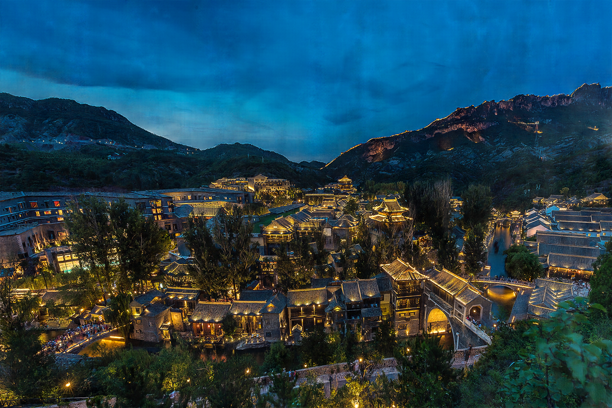 |
| Rain100L          | 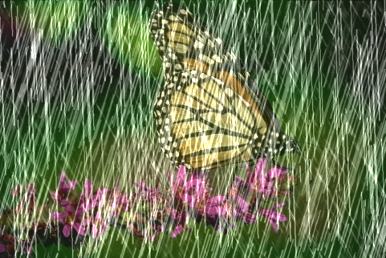  | 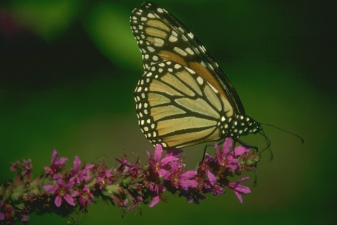        |  |
| Rain100H          | 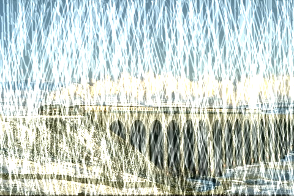  | 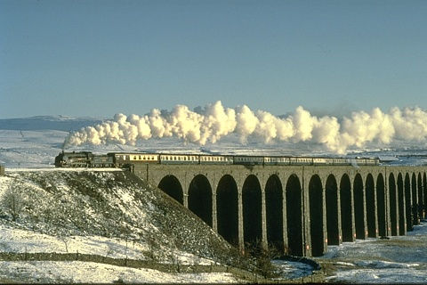        | 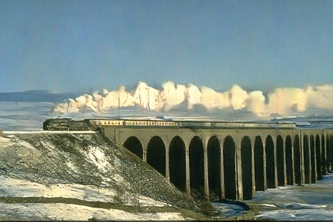 |
| LOLv2             | 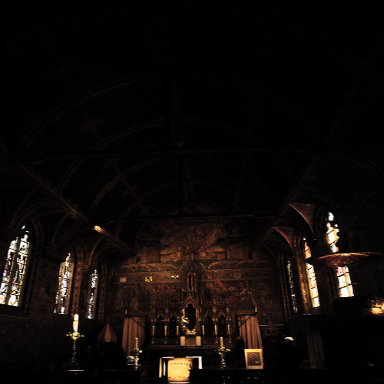   | 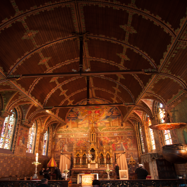             | 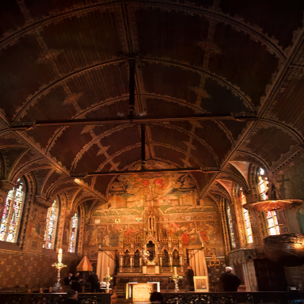 |
| LOLv1             | 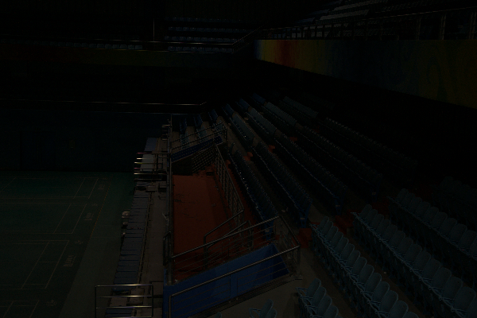   | 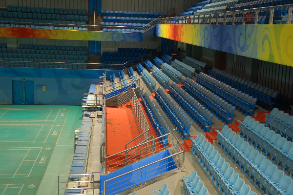   | 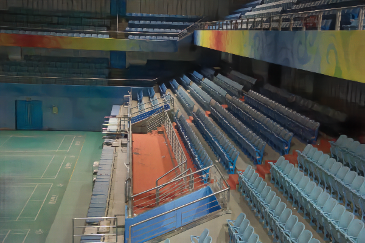 |
| LOL_Real          | 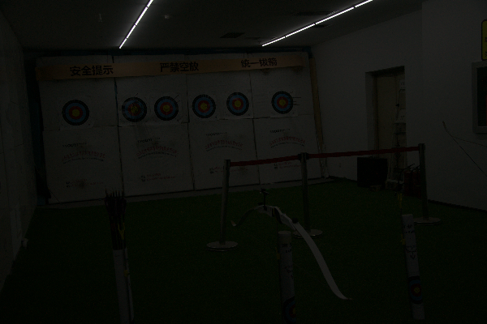 | 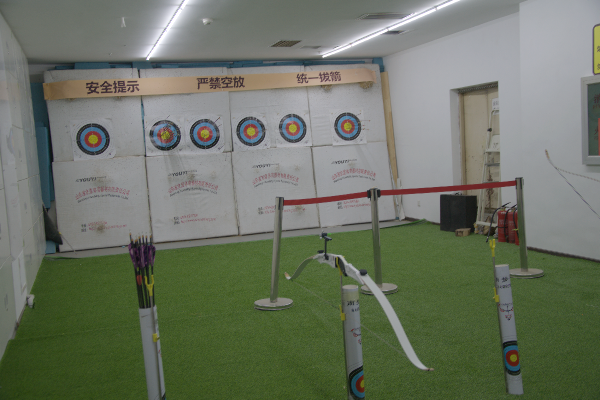   | 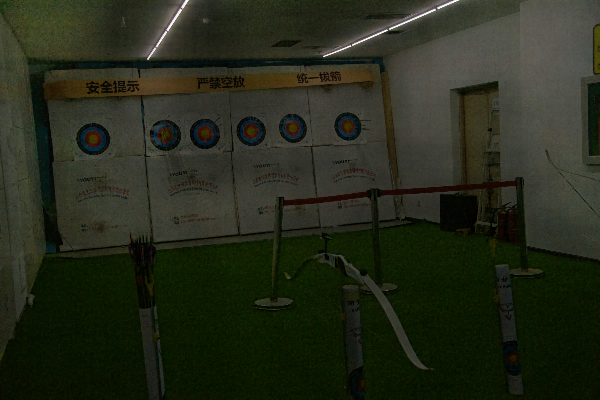 |


## Instruction 

You can try out the model weights and testing images included in the repository by following those steps:
1. Clone the repository:
    ```bash
    git clone https://github.com/lienghongky/cxm-vision
    cd cxm-vision
    ```
2. Install dependencies:

    Install the **UV** package manager if it is not already installed. You can install it using the following command:

    ```bash
    pip install uv
    ```

    While the environment is synced automatically, it may also be explicitly synced using:

    ```bash
    uv sync
    ```
3. Prepare your dataset by organizing it in the `datasets/` directory as shown bellow.
    For full benchmark againt other method download full evaluation set from officail page.
    
    Below is an example of the dataset structure used in this project:
    ```
    /cxm-vision/datasets/
    ├── UAV-Rain1k/
    │   ├── input/
    │   │   ├── rain_image1.jpg
    │   │   ├── rain_image2.jpg
    │   │   └── ...
    │   ├── gt/
    │   │   ├── clean_image1.jpg
    │   │   ├── clean_image2.jpg
    │   │   └── ...
    ├── LOLv1/
    │   ├── input/
    │   ├── gt/
    │   └── ...
    ```
    Each dataset contains paired images: `input` (e.g., rainy or low-light images) and `gt` (ground truth clean or enhanced images).


4. Test:
    - Test Datasets 
    ```bash
        uv run main.py --weights PATH_TO_WEIGHT_FOR_SPECIFIC_TASK --input_dir PATH_TO_TEST_SET --save 
    ```
    - Test your own file 
    ```bash
       uv run main.py --weights PATH_TO_WEIGHT_FOR_SPECIFIC_TASK --input_dir PATH_TO_TEST_FILE --save
    ``` 
    
### 🔗 Download Pretrained Model Weights
You can download additional pretrained model weights from the following link:  
[Google Drive - Model Weights](https://drive.google.com/drive/folders/11zlxsY3kbI8BTZe2Urc4_eto-DqKlYPT?usp=drive_link)


## Related Datasets and Papers

| Dataset      | Paper Title                                                                 | Paper Link                                                                                     | Dataset Link                                                                                     |
|--------------|-----------------------------------------------------------------------------|-----------------------------------------------------------------------------------------------|--------------------------------------------------------------------------------------------------|
| UAV-Rain1k   | UAV-Rain1k: A Benchmark for Raindrop Removal from UAV Aerial Imagery       | [Link](https://arxiv.org/pdf/2402.05773)                                                      | [Link](https://drive.google.com/file/d/1uELYr8-EesWXVi-Ty0vd4_7ig7taUDfq/view)                      |
| RainDrop     | Attentive generative adversarial network for raindrop removal from a single image | [Link](https://arxiv.org/pdf/1711.10098)                                                      | [Link](https://github.com/rui1996/DeRaindrop?tab=readme-ov-file)                                |
| RainDS       | Removing Raindrops and Rain Streaks in One Go                              | [Link](https://openaccess.thecvf.com/content/CVPR2021/papers/Quan_Removing_Raindrops_and_Rain_Streaks_in_One_Go_CVPR_2021_paper.pdf) | [Link](https://github.com/Songforrr/RainDS_CCN?tab=readme-ov-file)                              |
| DID-Data     | Density-aware Single Image De-raining using a Multi-stream Dense Network   | [Link](https://openaccess.thecvf.com/content_cvpr_2018/papers/Zhang_Density-Aware_Single_Image_CVPR_2018_paper.pdf) | [Link](https://github.com/hezhangsprinter/DID-MDN)                                              |
| SPA          | Spatial Attentive Single-Image Deraining with a High Quality Real Rain Dataset | [Link](https://arxiv.org/abs/1908.01979)                                                      | [Link](https://stevewongv.github.io/)                                                           |
| DDN-Data(aka: Test-1400,test-Fu,Rain-1400 )     | Removing rain from single images via a deep detail network                 | [Link](https://openaccess.thecvf.com/content_cvpr_2017/papers/Fu_Removing_Rain_From_CVPR_2017_paper.pdf) | [Link](https://xueyangfu.github.io/projects/cvpr2017.html)                                      |
| Rain Drop    | Dual-Pixel Raindrop Removal                                                | [Link](https://bmvc2022.mpi-inf.mpg.de/0439.pdf)                                              | [Link](https://github.com/Yizhou-Li-CV/DPRRN)                                                   |
| RAIN800      | Image De-raining Using a Conditional Generative Adversarial Network        | [Link](https://arxiv.org/pdf/1701.05957)                                                      | [Link](http://yu-li.github.io/paper/li_cvpr16_rain.zip)                                         |
| LOLv2         | From Fidelity to Perceptual Quality: A Semi-Supervised Approach for Low-Light Image Enhancement | [Link](https://openaccess.thecvf.com/content_CVPR_2020/papers/Yang_From_Fidelity_to_Perceptual_Quality_A_Semi-Supervised_Approach_for_Low-Light_CVPR_2020_paper.pdf) | [Link](https://github.com/flyywh/CVPR-2020-Semi-Low-Light) |
| LOLv1         | Deep Retinex Decomposition for Low-Light Enhancement | [Link](https://arxiv.org/pdf/1808.04560v1) | [Link](https://daooshee.github.io/BMVC2018website/) |


## Acknowledgement

1. This project adopts the **Gated-CNN** module from **MambaOut** model from the paper *"Do We Really Need Mamba for Vision?"* (CVPR 2025).For more details on MambaOut, visit the [MambaOut GitHub repository](https://github.com/yuweihao/MambaOut).


2. All the models are trained using **BasicSR** pipelines. BasicSR is a foundational library for image and video restoration tasks, providing efficient tools and utilities for model training and evaluation. For more details, visit the [BasicSR GitHub repository](https://github.com/XPixelGroup/BasicSR).


For more details, refer to the documentation or contact the project maintainers.
